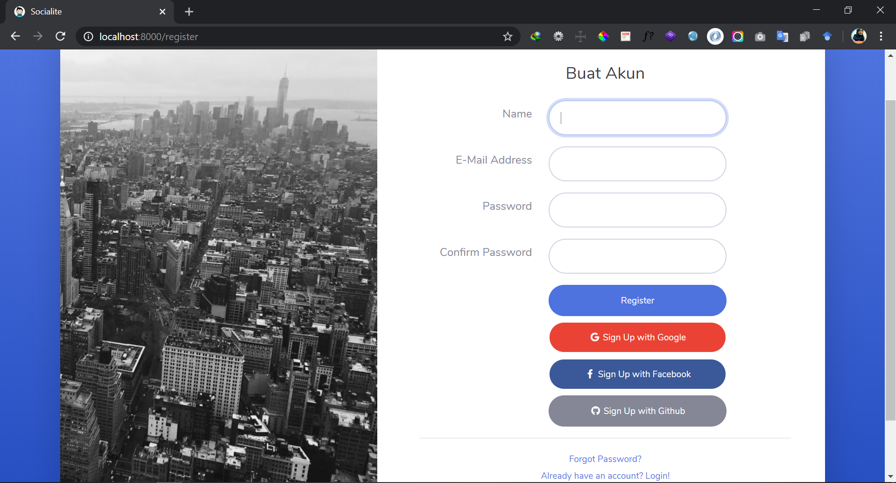

<h1>WEB SERVICE - Learn API <h1><br>

## Deskripsi
*Aplikasi ini merupakan aplikasi implementasi <b>handle login with social media</b> yang dibangun dengan menggunakan framework Laravel 5.8*  

## Petunjuk penggunaan:

Pastikan lakukan perintah berikut di terminal:
```console
composer update
```
Buat database dengan nama sesuai nama database yang ada di .env dan jalankan:
```console
php artisan migrate
```
```console
php artisan serve
```
Buka di browser

<p align="center"></p>
<p align="center"></p>
<p align="center"></p>

NB:
Update Client ID & Client Secret di file .env, jika login with social media tidak bisa dijalankan.
https://developers.google.com/identity/sign-in/web/sign-in <br>
https://developers.facebook.com/apps/ <br>
https://github.com/settings/developers <br>


## Contributors
- [Dewi Wulan Sari](https://github.com/dewiwss) -- 177006021
- [Sheila Maulida Intani](https://github.com/sheilamaulidaintani) -- 177006012
- [Fadilah Salsabila](https://github.com/fadilahsalsa) -- 177006006
